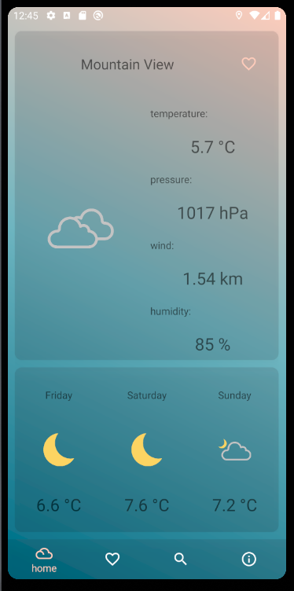
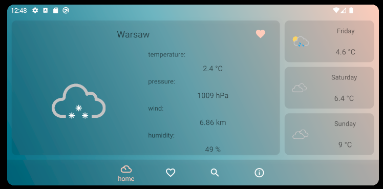
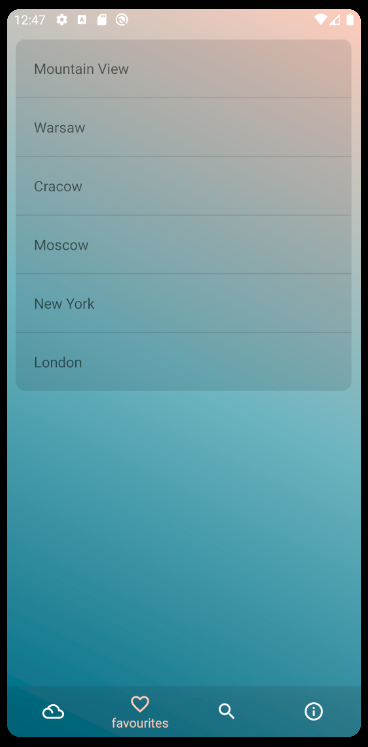

# Simple weather app for Android based devices

# Quick overview
This app was created as a project for High Level Languages classes ad AGH university. Second Author is [Sebastian Kulig](https://github.com/SebastianKulig)
Weather data is provided by OpenWeather API. 

## Main screen.

### Custom layout for horizontal orientation.

## Favourites tab.

## Search tab.

